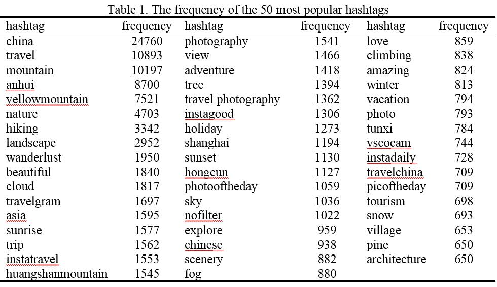
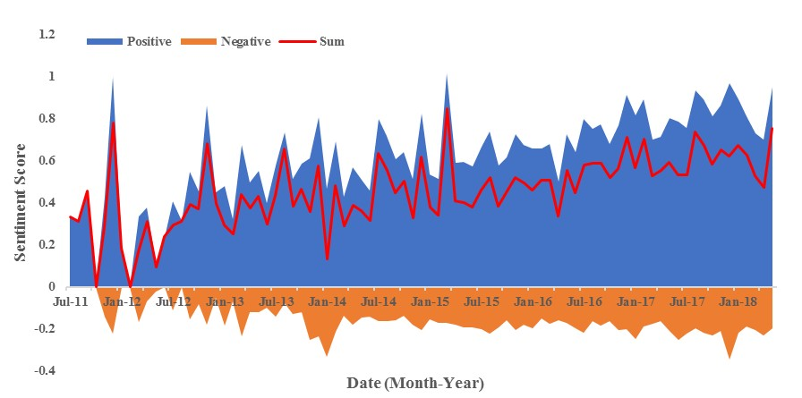
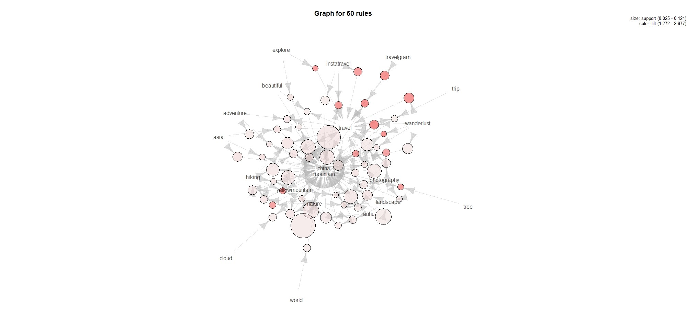

# Text-Mining
Text mining wiht instagram (#Huangshan) metadata
- hashtag analysis
- sentiment analysis
- association rule analysis

## Hashtag analysis
Got 301,427 hashtags (28,230 different hashtags) for the 36,981 posts, after removing the hashtag #Huangshan since it was used to search and retrieve our data. The frequency analysis results show that the top 100 hashtags appear 119,647 (40%) times 

## Sentiment analyis
Averaged the sentiment of Instagram text captions by month to show the temporal change of tourists’ sentiment. It seems the high positive sentiments tend to happen at summer (especially August) and winter (especially December)

## Association rule analysis
The association rules are mainly associated with #mountain, #china, #travel, #photography, suggesting that Huangshan City is a perfect place for travel and photography, and Mt. Huangshan is the name brand of Huangshan City or even China. 

